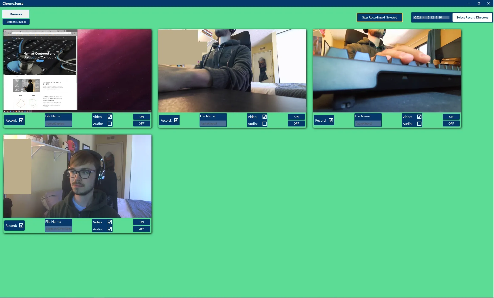

# ChronoSense

## Kinect Branch Overview
This branch contains the development of a Azure Kinect specific device integration into ChronoSense. It uses the [kinect-azure](https://github.com/wouterverweirder/kinect-azure#readme) NPM package to integrate the [Azure Kinect SDK](https://docs.microsoft.com/en-us/azure/kinect-dk/) into the ChronoSense Electron application. The kinect.js file is used instead of camera.js for any connected Kinect devices, and the preview can be depth, color, or body tracking overlayed video (see the README of [kinect-azure](https://github.com/wouterverweirder/kinect-azure#readme) for an example image of body tracking preview data).

File Differences - Main vs. Kinect Branches:  
- audiorecorder.js  
    - Hard-coded example of recording from the mic array on the Kinect, instead of from a single mic as seen in camera.js.
- kinect.js  
    - The Kinect class is written similarly to the Camera class in camera.js.
    - Instead of using MediaStream, it uses the [kinect-azure](https://github.com/wouterverweirder/kinect-azure#readme) functionality.
- chronosense.js  
    - setupDevices() scans for cameras and kinect devices separately, but treats them as 'devices' with similar properties.
- camera.js  
    - getDeviceObjects() filters out Kinect devices since they are instantiated in Kinect.js.
- jointwriter.js  
    - Writes the body tracking data to a customizable CSV file. 
    - Joint data retrieved from the [kinect-azure](https://github.com/wouterverweirder/kinect-azure#readme) skeleton object returned when capturing video via the Kinect.

## Overview  
ChronoSense is a foundational piece of recording software built on webtech with the express goal of making recording accesible, extensible, and ubiquitous no matter the device.

## Run ChronoSense Electron App:
-   CD into chronosense folder and enter the command `npm install` to make sure you have all the needed dependencies/electron (node-gyp, kinect-azure, production windows build tools, etc.).
-   Next enter `npm start` and the application window will open up.

## Get Up and Running for Developing:

1.  Clone the repository to a location of your choosing using the command:  
    `git clone https://github.com/WeibelLab/ChronoSenseV3.git`

2.  Make sure you have [Node.js](https://nodejs.org/en/) installed (includes node and npm commands).

3.  Navigate to where you cloned the ChronoSenseV3 folder and run the command:  
    `npm install`

4.  **(Optional)** If there are submodules not fully cloned in the ChronoSenseV3 folder, run the command:  
    `git submodule update --init --recursive`

5.  **(If on Windows)** Install node-gyp to fix some errors that may occur:  
    `npm install -g node-gyp`

6.  **(If on Windows)** Install all the required tools and configurations using Microsoft's windows-build-tools using  
    `npm install --global --production windows-build-tools` from an elevated PowerShell or CMD.exe (run as Administrator).

7.  Once you have the submodule installed for the 'kinect-azure' module (or in the node_modules folder), go to kinect-azure/ and enter the following command:  
    `npm install`

    -   _The above command will download the sensor dlls and other necessary files to use the Kinect in development and application use._

8.  Move the files that were created with the above command into the main ChronoSenseV3 folder.
    List of Files to move:

    -   cublas64_100.dll
    -   cudart64_100.dll
    -   cudnn64_7.dll
    -   dnn_model_2_0.onnx
    -   onnxruntime.dll
    -   vcomp140.dll

9.  Test to see if the application (as it is) can now run by going to the main ChronoSenseV3 folder and typing the following command to start the application:  
    `npm start`

10. **(Optional)** Go into the main.js file and uncomment `mainWindow.webContents.openDevTools();` if you would like to see the debugging window while running the application. 

11. Ready to Develop!  

## Create Executable Package  
1. Clone the repository  
2. Run `npm install` in the cloned repo directory  
3. Run `npm run package`  
4. Look for newly created directory inside of your current repo directory which will contain the created executable for ChronoSense
