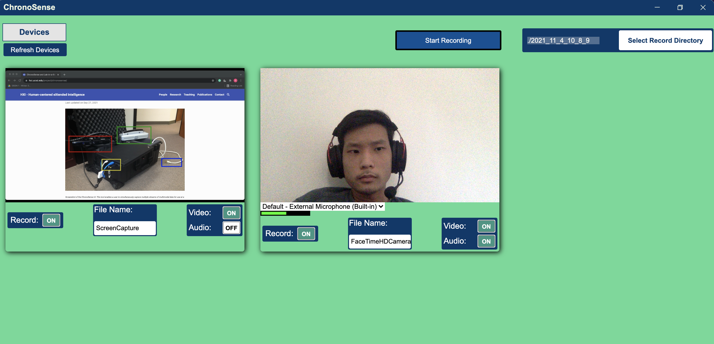

# Overview

ChronoSense serves researchers of all kinds by helping them more easily conduct observational research. Learning from [prior work](https://hxi.ucsd.edu/publication/weibel-2015-lab/), we discovered that temporally aware and aligned data capture can be incredibly difficult and time consuming. Especially when multiple software has to be used to collect disparate data from cameras, microphones, screen capture software, eye trackers, and more. Post-hoc alignment can be time-consuming as well as technically challenging, requiring special hardware, environment artifacts, or even special computational tooling. By providing a unified environment for the capture of multiple data streams, ChronoSense massively simplifies the task, giving observational researchers a tool to easily and quickly record data.

Looking ahead, beyond observational research, we enter into interventional studies. Here the goal is to not just study humans but to also generate an artifact that may provide some sort of feedback, support behavior modification, or otherwise prompt reflection that facilitates changes. On this front ChronoSense seeks to empower researchers with a data capture tool that can be extended to also perform inference and inform the design of interventional systems.

Things ChronoSense can help you do:
- Enable synchronized capture of several multimedia devices at the same time
- Allow you to stream data to other application for real-time analysis and processing
- Built with web technology to create compatibility with both Mac and Windows
- Plugin architecture enables extensions to be built and shared by the community

For Windows users, ChronoSense comes packaged with everything you need out of the box.

For Mac users we recommend you install Ffmpeg through [Homebrew](https://brew.sh/) with `brew install ffmpeg`.

To learn more about how to use the application (or to develop on top of it) check out the [README](https://github.com/WeibelLab/ChronoSense#readme)
